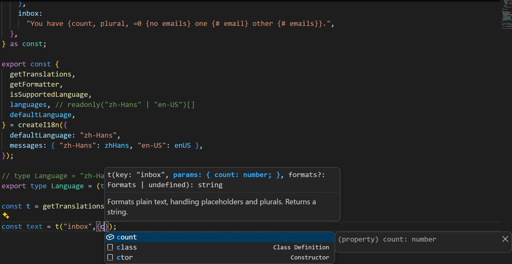

# ts-intl

[English](./README.md) | [简体中文](./README.zh-Hans.md) | [日本語](./README.ja-JP.md)



`ts-intl` is a lightweight, zero-dependency and strictly type-safe internationalization (i18n) library.

It provides a developer experience similar to `next-intl`, but without requiring Next.js or being tied to any specific framework.

## Design Principles

- **Zero Dependencies**: Zero runtime dependencies, no code generation steps, and no extra toolchain requirements.
- **Framework Agnostic**: Runs seamlessly in browsers, Node.js, Bun, and any other JavaScript / TypeScript environment.
- **Strict Type Safety**: Full TypeScript type inference for translation keys, parameters, and namespaces.

## Installation

```bash
npm install @aaakul/ts-intl
# or
pnpm add @aaakul/ts-intl
# or
yarn add @aaakul/ts-intl
```

## Quick Start

Here is a quick example showcasing basic interpolation, namespaces, and type inference:

```ts
// i18n/messages/en-US.ts
export default {
  common: {
    title: "System Dashboard",
    greeting: "Hello, {name: string}!",
    items: {
      one: "1 item in total",
      other: "{count} items in total",
    },
  },
} as const;
```

```ts
// i18n/messages/zh-Hans.ts
export default {
  common: {
    title: "系统仪表盘",
    greeting: "你好，{name: string}！",
    items: {
      one: "共 1 项数据",
      other: "共 {count} 项数据",
    },
  },
} as const;
```

```ts
// i18n/index.ts
import { createI18n } from "ts-intl";

// 1. Import translation files
import enUS from "./messages/en-US.ts";
import zhHans from "./messages/zh-Hans.ts";

// 2. Initialize and destructure exports
export const {
  getTranslations,
  getFormatter,
  isSupportedLanguage,
  languages, // readonly ("en-US" | "zh-Hans")[]
  defaultLanguage,
} = createI18n({
  defaultLanguage: "en-US",
  messages: { "en-US": enUS, "zh-Hans": zhHans },
});

// type Language = "en-US" | "zh-Hans"
export type Language = (typeof languages)[number];
```

```ts
import { getTranslations } from "./i18n";

// 3. Get translation function for a language and namespace
const t = getTranslations("en-US", "common");

// 4. Translate
const title = t("title");
// IDE inferred type: (key: "title") => string
// Output: "System Dashboard"

const greeting = t("greeting", { name: "Developer" });
// IDE inferred type: (key: "greeting", params: { name: string }) => string
// Output: "Hello, Developer!"

const items = t("items", { count: 5 });
// IDE inferred type: (key: "items", params: { count: number }) => string
// Output: "5 items in total"
```

## Supported Dictionary File Formats

`ts-intl` supports loading dictionary files written in TypeScript, JavaScript, and JSON.

### TypeScript Static Definitions (Recommended)

Defining dictionaries in TypeScript with `as const` automatically extracts strict types for keys, variable placeholders, and rich text tags:

```ts
export default {
  // ...
  auth: {
    login: "Sign In",
    welcome: "Welcome back, {username: string}!",
  },
} as const;
```

### JSON Dictionary Support

`createI18n` natively supports importing `.json` files as dictionaries without requiring global declaration merging or build plugins. It automatically infers all nested namespaces and key types with full autocomplete and typo checking:

```ts
import { createI18n } from "ts-intl";
import enUS from "./messages/en-US.json";
import zhHans from "./messages/zh-Hans.json";

export const {
  getTranslations,
  getFormatter,
  isSupportedLanguage,
  languages,
  defaultLanguage,
} = createI18n({
  defaultLanguage: "en-US",
  messages: { "en-US": enUS, "zh-Hans": zhHans },
});

const t = getTranslations("en-US", "common");
t("title"); // Precise autocomplete: "title" | "greeting" | "items"
// @ts-expect-error Key typo caught immediately by TypeScript
t("title_typo");
```

> **Type Inference Comparison**:
>
> - **JSON Dictionaries**: 100% strong typing for all namespaces and keys with autocomplete and error checks. However, because JSON does not support `as const`, template parameters (e.g. `{name}`) use relaxed type inference.
> - **TypeScript Dictionaries (`as const`)**: In addition to strong typing for keys, template placeholders (e.g. `{name: string}`, `{count: number}`) receive strict compile-time static type checking.

## Advanced Translation Features

### Universal Rich Text Interpolation `t.rich()`

`t.rich()` parses `<tag>children</tag>` within strings and maps them to custom components or node structures, seamlessly integrating with React JSX, Vue VNodes, Svelte, and other UI frameworks:

```ts
// const messages = {
//   en: {
//     notice: "Please review the <important>Safety Guidelines</important> and <link>Terms of Service</link>.",
//   },
// } as const;

const t = getTranslations("en");

// Parse into custom data structures
const tokens = t.rich("notice", {
  important: (children) => ({ type: "strong", text: children }),
  link: (children) => ({ type: "a", href: "/terms", text: children }),
});

// [
//   "Please review the ",
//   { type: "strong", text: "Safety Guidelines" },
//   " and ",
//   { type: "a", href: "/terms", text: "Terms of Service" },
//   "."
// ]
```

#### React

Render directly as React elements using `t.rich()`:

```tsx
import React from "react";
import { getTranslations } from "./i18n";

export function WelcomeBanner({ lang }: { lang: "en" | "zh" }) {
  const t = getTranslations(lang, "home");

  return (
    <div>
      {t.rich("banner", {
        bold: (children) => <strong className="font-bold">{children}</strong>,
        link: (children) => (
          <a href="/docs" className="underline">
            {children}
          </a>
        ),
      })}
    </div>
  );
}
```

#### Vue

In Vue 3, render rich text using the `h` render function or the dynamic `<component :is>` tag:

```vue
<script setup lang="ts">
import { h } from "vue";
import { getTranslations } from "./i18n";

const props = defineProps<{ lang: "en" | "zh" }>();
const t = getTranslations(props.lang, "home");

const renderedContent = t.rich("banner", {
  bold: (children) => h("strong", { class: "font-bold" }, children),
  link: (children) => h("a", { href: "/docs" }, children),
});
</script>

<template>
  <div>
    <component :is="() => renderedContent" />
  </div>
</template>
```

### HTML String Rendering `t.markup()`

When you only need a plain string containing HTML tags, use `t.markup()`. Tag callback functions must receive and return a string (returning non-string values will throw an `INVALID_MESSAGE` error, consistent with `next-intl`):

```ts
// const messages = {
//   en: {
//     notice: "Please review the <important>Safety Guidelines</important> and <link>Terms of Service</link>.",
//   },
// };

const html = t.markup("notice", {
  important: (c) => `<strong>${c}</strong>`,
  link: (c) => `<a href="/terms">${c}</a>`,
});
// Output: "Please review the <strong>Safety Guidelines</strong> and <a href="/terms">Terms of Service</a>."
```

### Extracting Raw Data `t.raw()`

Retrieve raw objects or arrays directly from dictionary files without triggering interpolation or placeholder replacement:

```ts
// const messages = {
//   en: {
//     config: { theme: "dark", level: 1 },
//     features: ["Lightweight", "Type-safe"],
//   },
// } as const;

const t = getTranslations("en");

const theme = t.raw("config");
// Inferred type: { readonly theme: "dark"; readonly level: 1 }

const list = t.raw("features");
// Inferred type: readonly ["Lightweight", "Type-safe"]
```

### Key Existence Check `t.has()`

Safely check whether a key exists in the current language or fallback language without triggering missing message warnings:

```ts
if (t.has("config")) {
  const cfg = t.raw("config");
}
```

## Type Safety Mechanism

### Strict Key Checking and Autocomplete

Supports both namespace scoping and root-level dot notation. When an invalid key or non-existent namespace is passed, TypeScript intercepts it with a compile-time error:

```ts
// const en = {
//   common: {
//     title: "System Dashboard",
//     greeting: "Hello, {name: string}!",
//     items: {
//       one: "1 item in total",
//       other: "{count} items in total",
//     },
//   },
// } as const;

const tCommon = getTranslations("en", "common");
tCommon("title");
// Autocomplete: "title" | "greeting" | "items"

const tRoot = getTranslations("en");
tRoot("common.title");
// Autocomplete: "common.title" | "common.greeting" | "common.items"
```

### Parameter Constraints

```ts
const t = getTranslations("en", "common");

// No placeholders: parameters forbidden
t("title");
// Inferred signature: (key: "title") => string

// With placeholders: parameters required
t("greeting", { name: "Alice" });
// Inferred signature: (key: "greeting", params: { name: string }) => string
```

### Explicit Parameter Type Annotations

In TypeScript dictionaries, you can explicitly declare placeholder parameter types using `{name:type}`. Supported types include `string`, `number`, and `Date`:

```ts
// const messages = {
//   en: {
//     status:
//       "User {name:string} logged in at {timestamp:Date}, total: {total:number}",
//   },
// } as const;

const t = getTranslations("en");

t("status", {
  name: "Alice",
  timestamp: new Date(),
  total: "100", // Error: Type 'string' is not assignable to type 'number'
});
```

### Multi-Language Dictionary Schema Alignment

Using `defaultLanguage` as the schema baseline, other languages configured in `messages` must maintain identical key structures and placeholder variable names. If another language has missing keys, extra keys, or misspelled variable names, TypeScript will surface a clear type error during initialization to eliminate untranslated gaps.

## Advanced ICU Features

`ts-intl` comes with built-in compatibility for ICU MessageFormat 1.x syntax, including plurals, ordinals, conditional selection (`select`), and number/date formatting.

### Pluralization

#### Structured Plural Objects

Supports defining objects with CLDR category keys `{ zero?, one, two?, few?, many?, other }` to handle complex pluralization rules across different languages:

```ts
// const en = {
//   cart: {
//     zero: "Cart is empty",
//     // Automatically infers { count: number } without explicit type annotations
//     one: "{count} item in cart",
//     other: "{count} items in cart",
//   },
// } as const;

const t = getTranslations("en");

t("cart", { count: 0 }); // Output: "Cart is empty"
t("cart", { count: 1 }); // Output: "1 item in cart"
t("cart", { count: 5 }); // Output: "5 items in cart"
```

#### ICU `plural` Template Syntax

```ts
// const messages = {
//   en: {
//     inbox:
//       "You have {count, plural, =0 {no emails} one {# email} other {# emails}}.",
//   },
// } as const;

const t = getTranslations("en");

t("inbox", { count: 0 }); // Output: "You have no emails."
t("inbox", { count: 1 }); // Output: "You have 1 email."
t("inbox", { count: 12 }); // Output: "You have 12 emails."
```

### Ordinal Formatting (`selectordinal`)

Matches ordinal rules using `selectordinal`, automatically replacing `#` with the number, and supports exact matching (`=1`, `=2`, etc.):

```ts
// const messages = {
//   en: {
//     rank: "You finished {pos, selectordinal, =1 {first} =2 {second} =3 {third} other {#th}}!",
//     birthday: "It's your {year, selectordinal, one {#st} two {#nd} few {#rd} other {#th}} birthday!",
//   },
// } as const;

const t = getTranslations("en");

// 1. Exact matching takes precedence (=value beats generic category rules)
t("rank", { pos: 1 }); // Output: "You finished first!"
t("rank", { pos: 4 }); // Output: "You finished 4th!"
t("rank", { pos: 21 }); // Output: "You finished 21th!" (Falls back to `other` since `one` is omitted)

// 2. Ordinal category rule matching (automatically matches English one/two/few/other rules)
t("birthday", { year: 1 }); // Output: "It's your 1st birthday!"
t("birthday", { year: 2 }); // Output: "It's your 2nd birthday!"
t("birthday", { year: 3 }); // Output: "It's your 3rd birthday!"
t("birthday", { year: 21 }); // Output: "It's your 21st birthday!"
```

### Conditional Selection (`select`)

Dynamically matches copy based on input status or enum values:

```ts
// const messages = {
//   en: {
//     memberStatus:
//       "{role, select, admin {Administrator} manager {Project Manager} other {General User}}",
//   },
// } as const;

const t = getTranslations("en");

t("memberStatus", { role: "admin" }); // Output: "Administrator"
t("memberStatus", { role: "guest" }); // Output: "General User"
```

### Named Format Presets and Built-in Formatting

Declare reusable number, date-time, and list presets in configuration, and reference them directly in templates:

```ts
const { getTranslations } = createI18n({
  defaultLanguage: "en",
  formats: {
    number: {
      currency: { style: "currency", currency: "USD" },
    },
    dateTime: {
      shortDate: { dateStyle: "short", timeZone: "UTC" },
    },
  },
  messages: {
    en: {
      invoice:
        "Total: {amount, number, currency}, Due: {dueDate, date, shortDate}",
    },
  },
});

const t = getTranslations("en");
t("invoice", {
  amount: 2500,
  dueDate: new Date("2026-10-01T00:00:00Z"),
});
// Output: "Total: $2,500.00, Due: 10/1/26"

// Temporarily override presets via the 3rd argument (aligned with next-intl API):
t(
  "invoice",
  { amount: 2500, dueDate: new Date("2026-10-01T00:00:00Z") },
  { number: { currency: { style: "currency", currency: "EUR" } } },
);
// Output: "Total: €2,500.00, Due: 10/1/26"
```

## Internationalization Formatter (`Formatter`)

`ts-intl` wraps standard Web `Intl` APIs with type safety and built-in instance caching, supporting numbers, currencies, dates, times, relative time, localized lists, and display names.

Two usage modes are available:

1. **`getFormatter(lang?)`** (Recommended): Destructured from `createI18n(...)`. Automatically inherits global `formats` presets, `timeZone`, and unified error handling, cached as a singleton per language.
2. **`createFormatter(options)`**: A standalone formatter factory that doesn't require a full i18n instance, ideal for independent modules or lightweight utilities.

### Method 1: Get `getFormatter()` from `createI18n` (Recommended)

Easily access a formatter bound to your global configuration:

```ts
import { createI18n } from "ts-intl";

export const { getTranslations, getFormatter } = createI18n({
  defaultLanguage: "en-US",
  formats: {
    number: {
      usd: { style: "currency", currency: "USD" },
      compact: { notation: "compact" },
    },
    dateTime: {
      shortDate: { dateStyle: "short" },
    },
  },
  timeZone: "America/New_York",
  messages: {
    "en-US": {
      /* ... */
    },
    "zh-Hans": {
      /* ... */
    },
  },
});

// 1. Get formatter for a specific language (singleton cache, zero re-instantiation overhead)
const formatter = getFormatter("en-US");

// 2. Defaults to defaultLanguage ("en-US") when omitted
const defaultFormatter = getFormatter();

// 3. Formatters for other supported languages also inherit global presets
const formatterZh = getFormatter("zh-Hans");

// Example usage:
formatter.number(888.8, "usd");
// Output: "$888.80"

formatter.number(1200000, "compact");
// Output: "1.2M"
```

### Method 2: Standalone `createFormatter(options)`

Suitable for modules where `createI18n` is not needed or custom options are required:

```ts
import { createFormatter } from "ts-intl";

const formatter = createFormatter({
  locale: "en-US",
  formats: {
    number: {
      usd: { style: "currency", currency: "USD" },
    },
  },
  timeZone: "America/New_York", // Optional default time zone
});
```

### Formatter API Quick Reference

Formatters obtained via `getFormatter()` or `createFormatter()` expose identical APIs:

```ts
// 1. Numbers and Currencies (standard Intl options or named presets)
formatter.number(1234567.89);
// Output: "1,234,567.89"

formatter.number(888.8, "usd");
// Output: "$888.80" (Using named preset)

formatter.number(888.8, "usd", { maximumFractionDigits: 0 });
// Output: "$889" (Overriding preset options)

// 2. Dates and Times
formatter.dateTime(new Date("2026-09-11T12:00:00Z"), { dateStyle: "full" });
// Output: "Friday, September 11, 2026"

// 3. Date Ranges
formatter.dateTimeRange(new Date("2026-05-01"), new Date("2026-05-05"));
// Output: "5/1/2026 – 5/5/2026"

// 4. Relative Time (automatically calculates best unit based on time difference)
const twoHoursAgo = new Date(Date.now() - 2 * 60 * 60 * 1000);
formatter.relativeTime(twoHoursAgo);
// Output: "2 hours ago"

// Supports custom reference time and `numeric` option ("auto" displays "yesterday" / "tomorrow")
formatter.relativeTime(new Date("2026-06-02"), {
  now: new Date("2026-06-01"),
  numeric: "auto",
});
// Output: "tomorrow"

// 5. Localized List Formatting (ListFormat)
formatter.list(["Apple", "Banana", "Orange"]);
// Output: "Apple, Banana, and Orange"

// 6. Localized Display Names (DisplayNames)
formatter.displayName("en-US", { type: "language" });
// Output: "American English"

formatter.displayName("US", { type: "region" });
// Output: "United States"
```

## Error Handling and Fallbacks

Provides unified runtime error monitoring and custom message fallback strategies:

```ts
import { createI18n, I18nError, I18nErrorCode } from "ts-intl";

export const i18n = createI18n({
  defaultLanguage: "en-US",
  messages: { "en-US": { hello: "Hello" } },

  // Unified error callback
  onError(error: I18nError) {
    if (error.code === I18nErrorCode.MISSING_MESSAGE) {
      console.warn(
        `[I18n Warning] Missing message: ${error.key} (lang: ${error.lang})`,
      );
    } else if (error.code === I18nErrorCode.INVALID_KEY) {
      console.warn(`[I18n Warning] Invalid key: ${error.message}`);
    } else if (error.code === I18nErrorCode.INVALID_MESSAGE) {
      console.warn(
        `[I18n Warning] Invalid message callback return type: ${error.message}`,
      );
    } else if (error.code === I18nErrorCode.MISSING_FORMAT) {
      console.warn(`[I18n Warning] Named format not found: ${error.message}`);
    } else if (error.code === I18nErrorCode.FORMATTING_ERROR) {
      console.warn(`[I18n Warning] Formatting error: ${error.message}`);
    }
  },

  // Custom missing message fallback strategy
  getMessageFallback({ error, key, lang, namespace }) {
    return `[Untranslated: ${key}]`;
  },
});
```

In non-production environments, `createI18n` validates dictionary objects at initialization time to detect whether keys mistakenly contain dots (e.g. `{"foo.bar": "value"}` which creates path ambiguity) and warns through `onError`. In production, this check is skipped to guarantee zero runtime overhead.

### API Reference

#### `createI18n` Return Values

| Property / Method                   | Type                           | Description                                                                                                |
| :---------------------------------- | :----------------------------- | :--------------------------------------------------------------------------------------------------------- |
| `getTranslations(lang, namespace?)` | `Function`                     | Returns the translation function `t` for a given language (and optional namespace). Pure sync & stateless. |
| `getFormatter(lang?)`               | `(lang?: string) => Formatter` | Returns the formatter instance for a language (defaults to `defaultLanguage`, singleton cached).           |
| `isSupportedLanguage(lang)`         | `(lang: string) => boolean`    | Runtime Type Guard checking if a language is configured in `messages`.                                     |
| `languages`                         | `readonly string[]`            | Readonly array of all supported language codes.                                                            |
| `defaultLanguage`                   | `string`                       | The configured default baseline language code.                                                             |

#### Translator Methods (`t`)

| Method                             | Return Type       | Description                                                                                                  |
| :--------------------------------- | :---------------- | :----------------------------------------------------------------------------------------------------------- |
| `t(key, params?, formats?)`        | `string`          | Formats plain text, handling placeholder replacement, plurals, and per-call format overrides.                |
| `t.rich(key, params?, formats?)`   | `(string \| R)[]` | Formats rich text token arrays; callbacks can return any component/node. Supports per-call format overrides. |
| `t.markup(key, params?, formats?)` | `string`          | Formats HTML string; callbacks must return strings. Supports per-call format overrides.                      |
| `t.raw(key)`                       | `Exact / any`     | Retrieves raw objects or arrays at the specified path (exact type inferred if key exists).                   |
| `t.has(key)`                       | `boolean`         | Checks if a key exists without emitting missing message warnings.                                            |

#### Formatter Methods (`formatter`)

| Method                                                              | Description                                                                                |
| :------------------------------------------------------------------ | :----------------------------------------------------------------------------------------- |
| `formatter.number(value, formatOrOptions?, overrides?)`             | Formats numbers, currencies, and percentages (supports presets or standard Intl options).  |
| `formatter.dateTime(date, formatOrOptions?, overrides?)`            | Formats dates and times (supports presets or standard Intl options).                       |
| `formatter.dateTimeRange(start, end, formatOrOptions?, overrides?)` | Formats date/time ranges.                                                                  |
| `formatter.relativeTime(date, nowOrOptions?)`                       | Formats relative time (e.g. "3 days ago", "yesterday", automatically picks the best unit). |
| `formatter.list(items, formatOrOptions?, overrides?)`               | Joins list items naturally according to locale rules (e.g. "Apple, Banana, and Orange").   |
| `formatter.displayName(code, formatOrOptions, overrides?)`          | Localized display names for languages, regions, currency symbols, etc.                     |

## License

[MIT](./LICENSE)
